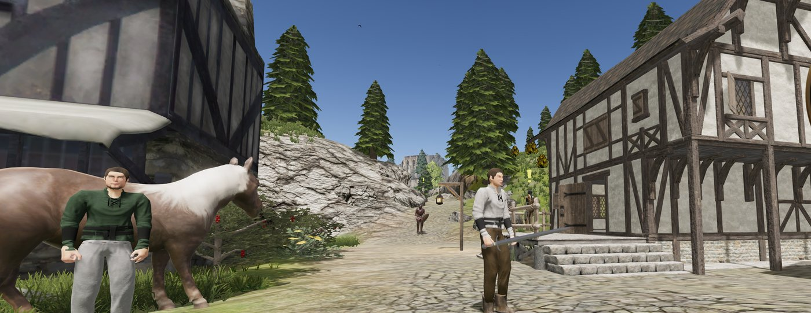
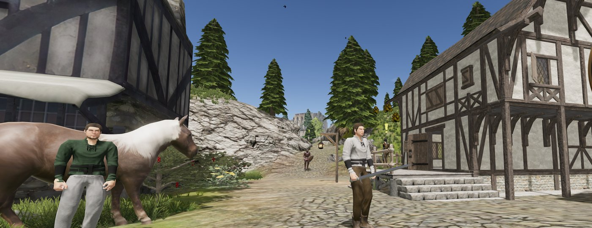
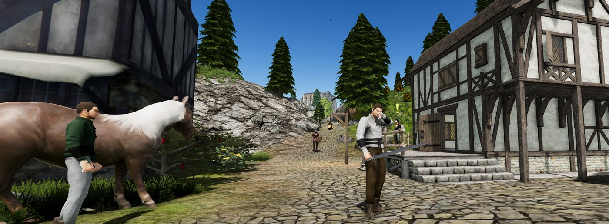
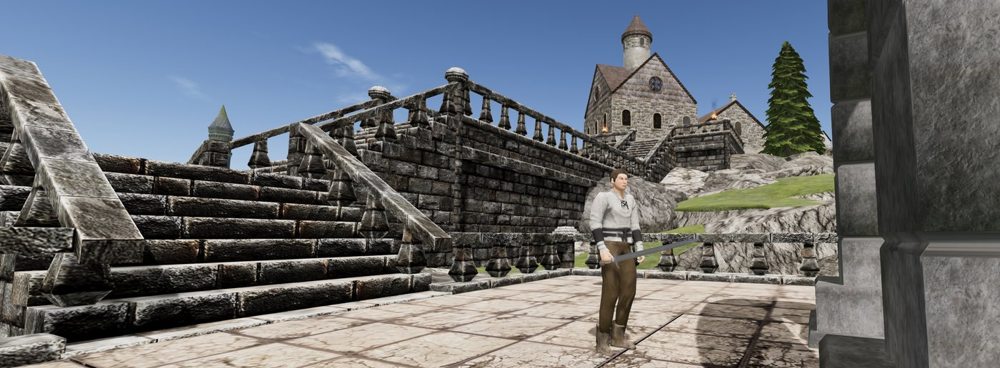
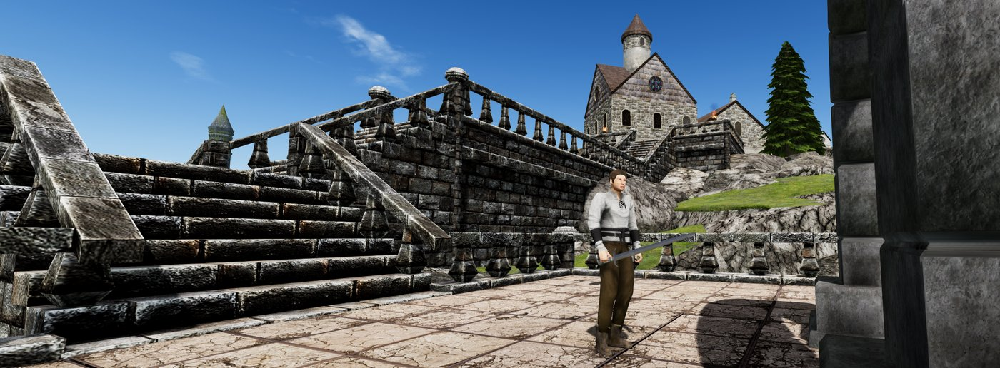
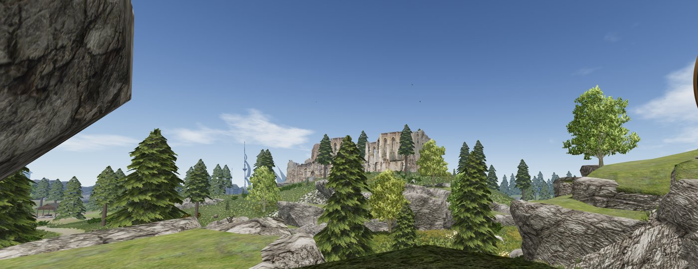
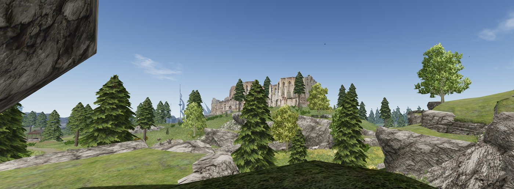
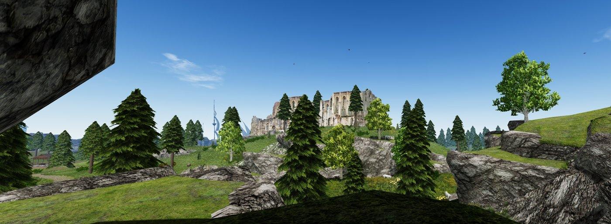

# GSO HD Textures

A BepInEx plugin that swaps **Gran Skrea Online**'s textures for higher-resolution versions at runtime, plus a pipeline that builds those versions from your own copy of the game with AI upscaling (Real-ESRGAN). No game files are modified. Remove the plugin and the game is back to stock.

It works with or without GSO Offline Server.

**Installing:** see [docs/INSTALL.md](docs/INSTALL.md), with step-by-step guides for installing from a release zip and from your own build, plus building the texture pack.

## Before and after

Each row is the same moment from the same spot, switched in-game: the original game, the HD texture pack, and the HD texture pack with [enhanced lighting](#enhanced-lighting) (the default). Click an image for full size. The lighting is the most visible change; the HD textures mostly show up close and on large surfaces such as walls, rocks and the ground.

| Original | HD textures | HD textures + enhanced lighting |
|---|---|---|
|  |  |  |
|  |  |  |
|  |  |  |

Screenshots taken on a 3440-pixel-wide screen and scaled down (interface cropped off), with a texture pack built by `tools/textures/` from the game's own art. The pack itself is not distributed.

## About this project

This is a non-commercial passion project for a game that is no longer sold. It is not affiliated with or endorsed by the original developers or publisher. "Gran Skrea Online" and all game assets belong to their respective owners.

**This repository and its release zips contain no game textures.** The texture pack is derived from proprietary art, so you build it locally from your own install (below). `work/` is git-ignored for that reason.

## How it works

```
game assets ──dump.ps1──▶ work/dump/<key>.png ──upscale.ps1──▶ work/upscaled/ ──pack.ps1──▶ work/pack/ ──-Deploy──▶ <game>/BepInEx/plugins/GSOHDTextures/textures/
                                                               work/overrides/ (hand-made, wins) ┘
```

- **Key:** every texture is identified as `<name>__<width>x<height>` (the original size), e.g. `Roof_A_A__512x512.png`. A few keys are shared by different images (e.g. four different `Material.001_Base_Color`) or differ only in case. The plugin can't tell those apart, so `dump.ps1` marks them and they keep their original look.
- **Plugin:** at scene load it scans all materials and terrain textures behind the loading screen, loading every matching file at once so you arrive with the scene sharp. During play it keeps checking for new materials (NPCs, equipment, effects) a slice at a time (about 1 ms per frame), and new textures are read on a background thread and uploaded one per frame, so nothing stalls a frame. Packs are BC7 `.dds` files with mipmaps, uploaded to the GPU as-is. A hand-made `.png` also works; it is decoded and compressed in-game, which is slower. Terrain grass is left alone (Unity builds it on the CPU, which compressed textures break).
- **Upscaling:** Real-ESRGAN x4 runs on a wrap-padded copy of each texture so tiling edges stay seamless. The result is cropped and Lanczos-resized to `-Scale` (default 2×, max 4096). Its brightness and colour are corrected back to the original's (the AI only adds detail), and alpha is restored from the original. Normal, height, metallic, gloss, AO and mask maps get a plain resize, because AI detail breaks lighting.

## Interface scaling

The classic interface (HUD, hotbar, chat, every window, the login and character screens) is drawn at 1:1 pixels, so it gets tiny on 1440p, ultrawide and 4K screens. The plugin scales it:

- **Automatic:** the interface looks as it was designed on a 1080p screen: 133% at 1440p, 200% at 4K.
- **Your preference on top:** in-game under **Main menu → Video options → Interface scale** (50% to 200%, applied when you let go of the slider), or with **Ctrl + =** and **Ctrl + -** in 5% steps and **Ctrl + 0** to reset. The new size shows briefly on screen and is saved to `UI.Scale`.
- The newer canvas parts (minimap, zone name) follow the same preference.
- Icons and other interface images are drawn from the texture pack when it has them, so they stay sharp. Text is re-rendered at the new size, not magnified.

Turn it off with `UI.Enabled = false`, or set `UI.AutoScale = false` to use native pixels times `UI.Scale`. The game's own `/scalegui` console mode (a stretch to a fixed size) takes precedence when it's on.

## Enhanced lighting

The original look is flat and washed out: one grey ambient colour everywhere, exposure pushed up (+1.4) with contrast lowered (0.85), no ambient occlusion and no anisotropic filtering. The plugin uses what the game already ships to do better:

- **Sky ambient:** shaded areas take the sky, horizon and ground colours from the time-of-day sky (softened so daylight doesn't turn blue), instead of one flat grey.
- **Ambient occlusion:** soft contact shadows in corners, under roofs and where things meet the ground.
- **Grading:** exposure 1.15, contrast 1.1, saturation 1.1. Caves and dungeons keep the original exposure, because they're lit by torches.
- **Anisotropic filtering:** ground and walls stay sharp at shallow angles.
- **Moonlit nights:** the original nights leave everything not facing the moon pitch black. A soft blue moonlight fill keeps characters and the ground readable.

Press **F10** in-game to switch between the original and enhanced look. Every part can be tuned or turned off under `[Graphics]` in the config. It costs no measurable frame rate on an RX 7900 XTX.

## Weather and day/night

The game has a complete weather system (clouds, an overcast layer, rain with its own sound, fog and a time-of-day sky), but the server drove it, so offline the sky never changes. The plugin drives it instead:

- **Day and night** run continuously, a full cycle every 15 minutes (`Weather.DayLengthMinutes`), and keep going when you change zones.
- **Weather** changes every 4 to 10 minutes between clear, partly cloudy, overcast, rain and fog, blending over a minute. It's mostly fair (`Weather.Mix`, default 40/30/15/10/5), and fog is most likely early in the morning. It never snows.
- **Under heavy cloud** the sun dims and shadows soften. **In fog** the view closes in to about 110 m.
- **With enhanced lighting on, the picture follows the time and weather:** warm at dawn and dusk, cooler at night, duller and darker in rain (`Weather.Mood`, 0 = off).

Caves and dungeons keep their own lighting and fog, with no rain. GSO Offline Server's `/time` command still sets the clock.

## Building a texture pack

Requirements: Windows, Python 3.10+, a Vulkan-capable GPU, and the plugin installed (next section). The Python venv and the pinned, hash-checked Real-ESRGAN build are set up automatically on first use.

```powershell
.\tools\textures\dump.ps1                 # 1. export ~3,800 textures to work\dump (a few minutes)
.\tools\textures\upscale.ps1              # 2. AI upscale into work\upscaled (hours for everything; resumable)
.\tools\textures\pack.ps1                 # 3. build the finished pack in work\pack (add -Deploy to copy it into the game)
```

`work\pack\` holds the finished pack: one `<name>__<width>x<height>.dds` per texture. To install it by hand, copy those files into `<game>\BepInEx\plugins\GSOHDTextures\textures\` (create the folder if needed). `-Deploy` does the same and also removes files there that are no longer in the pack. The pack is derived from the game's art, so build it from your own copy and keep it to yourself.

Working on a subset first is much faster:

```powershell
.\tools\textures\dump.ps1 -Only Roof_A                           # just textures whose name contains Roof_A
# or: play with RecordSeenTextures = true, then use the list of textures you actually saw
.\tools\textures\upscale.ps1 -OnlyList '<game>\BepInEx\GSOHDTextures-seen.txt'
.\tools\textures\pack.ps1   -OnlyList '<game>\BepInEx\GSOHDTextures-seen.txt' -Deploy
```

To hand-fix a texture, put your version in `work\overrides\<key>.png` (any size, same aspect ratio) and re-run `pack.ps1 -Deploy`. To try one quickly, drop `<key>.png` into the game's `textures` folder (a PNG beats a DDS with the same key) and press **F9** in-game to reload the pack without restarting.

Useful options: `upscale.ps1 -Model realesrgan-x4plus-anime` (for flat, stylised art), `-Tile 256` (low VRAM), `-Gpu 1`; `pack.ps1 -Scale 4`, `-MaxSize 2048` (less VRAM and disk), `-Jobs 6` (parallel BC7 encoders; each can need over 1 GB of RAM).

## Building and installing the plugin

You need your own copy of Gran Skrea Online. The build reads the game's DLLs to compile against; it never copies them into the output and never writes to the game.

```powershell
.\build.ps1                          # Debug build into artifacts\build\Debug; the game is untouched
.\build.ps1 -Deploy                  # ...and copy it into the game (close the game first)
.\build.ps1 -InstallBepInEx -Deploy  # first time, as a convenience: also put BepInEx into the game
.\build.ps1 -Configuration Release
```

Every build lands in `artifacts\build\<Configuration>\`, laid out exactly like the game folder, with an `INSTALL.txt`:

```
artifacts\build\Debug\
  INSTALL.txt
  BepInEx\plugins\GSOHDTextures\GSOHDTextures.dll
```

Review it there, then install it either way:
- **By hand:** install [BepInEx 5.4.23.5 (x64)](https://github.com/BepInEx/BepInEx/releases) into the game folder (the one with `GSO.exe`), then copy this `BepInEx` folder into it, merging. Put a texture pack in `<game>\BepInEx\plugins\GSOHDTextures\textures\` (see above). Interface scaling works without a pack.
- **With the scripts:** `build.ps1 -Deploy` copies the plugin, `-InstallBepInEx` installs BepInEx, and `pack.ps1 -Deploy` copies the pack.

BepInEx's DLLs for compiling come from the same pinned, hash-checked BepInEx zip, unpacked into `.cache\`, so building doesn't need BepInEx in the game. Release zips (`release.ps1`) use the same layout.

Settings are in `BepInEx/config/gso.hdtextures.cfg`:

| Setting | Default | |
|---|---|---|
| `General.Enabled` | true | |
| `General.TextureFolder` | `textures` | relative to the plugin folder, or absolute |
| `General.CompressTextures` | true | `.png` replacements only: compress to DXT after loading, about ¼ of the VRAM but slower |
| `General.ScanInterval` | 2 | seconds between scans for new materials; 0 = scan on scene load only |
| `Advanced.ExtraTextureProperties` | | extra shader properties to check; suffix `!` for linear data |
| `Debug.ReloadKey` | F9 | |
| `Debug.LogReplacements` | false | |
| `Debug.RecordSeenTextures` | false | writes `BepInEx/GSOHDTextures-seen.txt` |
| `UI.Enabled` | true | scale the interface (restart to switch completely) |
| `UI.AutoScale` | true | grow with the screen height (1080 px = 100%) |
| `UI.Scale` | 1 | your preference on top, 0.5 to 3; also Video options → Interface scale, or Ctrl + = / - / 0 |
| `UI.HdTextures` | true | draw interface images from the texture pack |
| `UI.ScaleUpKey` / `ScaleDownKey` / `ScaleResetKey` | Ctrl + = / - / 0 | |
| `Graphics.EnhancedLighting` | true | the lighting changes above |
| `Graphics.ToggleKey` | F10 | compare with the original look in-game |
| `Graphics.SkyAmbient` | true | ambient light from the sky instead of flat grey |
| `Graphics.SkyAmbientTint` / `SkyAmbientBrightness` | 0.5 / 1.6 | how much sky colour (0 = neutral), and how bright the shade is |
| `Graphics.AmbientOcclusion` / `AmbientOcclusionIntensity` | true / 1 | |
| `Graphics.Exposure` / `Contrast` / `Saturation` | 1.15 / 1.1 / 1.1 | original: 1.4 / 0.85 / 1 |
| `Graphics.Bloom` | 1 | glow, relative to the original |
| `Graphics.AnisotropicFiltering` | true | |
| `Graphics.NightBrightness` | 2 | moonlight fill at night; 0 = the original pitch-dark nights |
| `Weather.Enabled` | true | changing weather and continuous day/night |
| `Weather.DayLengthMinutes` | 15 | real minutes per full day; the game's own speed is 40 |
| `Weather.Mix` | `Clear=40,PartlyCloudy=30,Overcast=15,Rain=10,Fog=5` | relative weights |
| `Weather.MinMinutes` / `MaxMinutes` | 4 / 10 | how long each kind of weather lasts |
| `Weather.BlendSeconds` | 60 | how long a change of weather takes |
| `Weather.Mood` | 1 | time-of-day and weather tint (with enhanced lighting), 0 = off |

The game folder is found automatically in any Steam library. Override it with `-GameDir`, `GSO_GAME_DIR` or `-p:GameDir=`.

## Branches and releasing

| Branch | Role |
|---|---|
| `main` | Releases only. Each release is one reviewed pull request from `dev`. |
| `dev` | Integration. Every feature merges here. |
| `feature/<area>/<name>`, `fix/<area>/<name>` | One piece of work, branched from `dev`, e.g. `feature/ui/sprite-replacement`. |

Branch from `dev`, work locally, then merge it back with `git merge --no-ff` (one merge per feature on `dev`), push `dev` and delete the branch. Feature branches stay local unless you want one backed up or shared. If `dev` moved on and the feature conflicts, rebase the branch onto `dev` while it's local, or merge `dev` into it if it has been pushed.

Changes that could break the game, carry a security risk (downloads, running processes, deleting files, new dependencies, what goes into release zips), are large (roughly 300+ lines of code or 10+ files) or touch core files (the Harmony transpilers, `TextureStore`/`TextureReplacer`, the texture key, the build and release scripts) go to `dev` through a pull request that the maintainer reviews and merges on GitHub. The branch's final commit is the pull request: first line the title, the rest the description. Merge with **Create a merge commit**.

`build.ps1` makes **dev builds**, versioned like `1.0.0-dev+<branch>.<commit>` and logged at startup with "(dev build)"; they're for testing, never shipped. Only `release.ps1` makes **release builds** (plain version, tagged, zipped).

A release (PowerShell 7) packages the plugin only, never textures. It runs on `dev`, and its commit ("Release vx.y.z" plus that version's CHANGELOG section) becomes the `dev` -> `main` pull request:

```powershell
git switch dev; git pull --ff-only
.\release.ps1 -Version x.y.z -DryRun
.\release.ps1 -Version x.y.z        # commits and tags on dev; it never pushes
git push origin dev                 # then open the pull request dev -> main from that commit
# once it's merged:
git push origin vx.y.z
git switch main; git pull --ff-only; git switch dev; git merge --ff-only main; git push
```

## Known limitations / roadmap

- Canvas sprites (UGUI `Image`, e.g. the minimap frame) are not replaced with HD versions yet. A sprite's rect is in pixels, so it needs rebuilding at the new scale. Window frames drawn from the GUI skin are scaled but not replaced either; they hold up well up to about 2x.
- At large scales on ultrawide screens the minimap (which also grows with screen width) can touch the HUD buttons next to it.
- Only the shader properties in `TextureReplacer.BuiltInProperties` are checked (Unity 2017.4 can't list them at runtime). The list was mined from the game's materials with `tools/textures/props.py`; add others with `ExtraTextureProperties`.
- Entering a new scene loads its textures behind the loading screen, so it takes a moment longer than stock. During play, new textures stream in and can show their original for a moment first.
- The game itself makes a ~15 ms garbage-collection pause every few seconds (Unity 2017's collector stops the game); that is in the original too and can't be fixed from a plugin.
- BC7 needs DirectX 11. Under DirectX 9 the plugin ignores `.dds` files and says so in the log.
- Lightmaps, reflection probes and font atlases are deliberately left alone.

## License

GPL-3.0-or-later for the code in this repository (see `LICENSE`).
